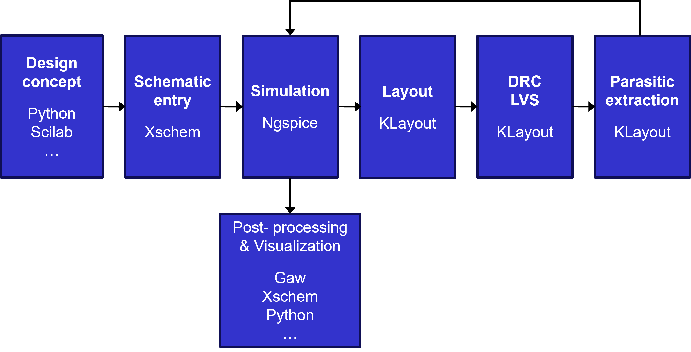

   

  

There are numerous ways in which you can install the open-source chip design tools for this course. The simplest, "default" method is to use the pre-packaged Docker container provided by Harald Pretl's lab:

* IIC-OSIC-TOOLS: https://github.com/iic-jku/iic-osic-tools

Here are the EE 628 installation instructions by computer platform:  
* [Windows](win.md)  
* [Linux](linux.md)  
* [Mac](mac.md)  

If you are a "Liunx person," you can also install the tools from scratch. Below are a few references that would be useful to you in this endeavour.

* T. Edwards et al., "Efabless Recommended Open Source Analog Design Flow."  
https://docs.google.com/document/d/1QXi2kqWgQ8JR_BJCfUgFkQCSSxetXcnWrDHRJdLBsy0

* C. Talarico, "VLSI Design Flow."  
https://web02.gonzaga.edu/faculty/talarico/vlsi/vlsi.html

Regardless of how you install the tools, you will occasionally need to look at their documentation. Here is a list of useful links.

* Xschem: http://repo.hu/projects/xschem/xschem_man/xschem_man.html
* Ngspice: https://ngspice.sourceforge.io/docs.html
* KLayout: https://www.klayout.de/  
* Magic: http://opencircuitdesign.com/magic/  

