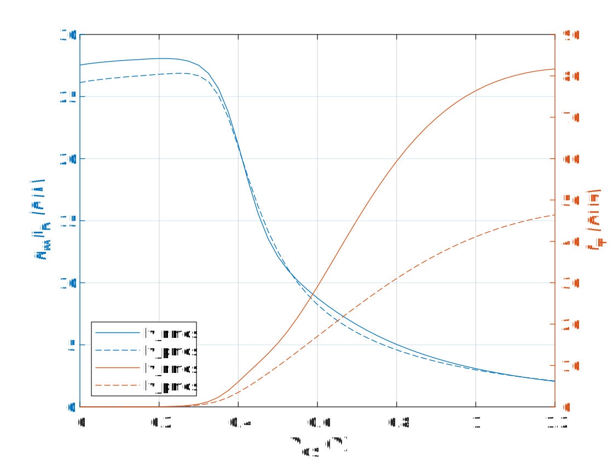

<p align="center">
   
</p>

In the above plot, $f_T=1/2\pi \cdot g_m/C_{gg}$, where $C_{gg} = cgg+cgsol+cgdol$. The lower case variables are capacitances reported by Ngspice.

For mixed-signal design $f_T$ is a measure of how much transconductance the designer gets per invested (total) gate capacitance. In other words, it is not meant to represent the physical unity gain frequency, which is harder to compute. Similarly, $g_m/I_D$ quantifies how much transconductance the designer gets per invested current.

The initial slope of the NMOS $f_T$ (in weak/moderate inversion) does not look particularly smooth. Closer inspection reveals that that there is an odd "kink" in the intrinsic $cgg$ computed by Ngspice. The only reason why this kink does not show up more clearly is that the devices are modeled to have relatively large overlap capacitances ($cgsol$, $cgdol$).

To see the potential issue with the values of the overlap capacitances, consider the op output appended below. The overlap capacitance per width is $cgdol/W = 3.02492\cdot 10^{-15} F /5\mu m = 0.605 fF/\mu m$. The current [Process Specification Rev. 1.1](https://github.com/IHP-GmbH/IHP-Open-PDK/blob/main/ihp-sg13g2/libs.doc/doc/SG13G2_os_process_spec.pdf) states a target value for "Miller Capacitance NMOS" as $0.36fF/\mu m$, which is in fact well aligned with values seen for comparable CMOS technologies.


 ```
PSPNQS103VA: A simulator independent device loaded with OSDI
     device   n.xm1.nsg13_lv_nmos
      model xm1:sg13g2_lv_nmos_ps
   _mfactor                     1
          m                     1
          l               1.3e-07
          w                 5e-06
         sa                     0
         sb                     0
         sd                     0
        sca                     0
        scb                     0
        scc                     0
         sc                     0
         nf                     1
      ngcon                     2
        xgw                 1e-07
        nrs                     0
        nrd                     0
         jw                 1e-06
     delvto                     0
     factuo                     1
 delvtoedge                     0
 factuoedge                     1
   absource                 1e-12
   lssource                 1e-06
   lgsource                 1e-06
    abdrain                 1e-12
    lsdrain                 1e-06
    lgdrain                 1e-06
         as               1.7e-12
         ps             1.068e-05
         ad               1.7e-12
         pd             1.068e-05
       mult                     1
        dta                     0
      ctype                     1
      sdint                     1
        ise          -6.92497e-05
        ige           1.25332e-12
        ide           6.92497e-05
        ibe           -8.8622e-15
        ids           6.92497e-05
        idb           5.75385e-15
        isb           3.10834e-15
        igs           7.66786e-13
        igd           4.86537e-13
        igb           6.96325e-23
     idedge                     0
       igcs           5.49479e-13
       igcd           4.86537e-13
       iavl           1.94124e-17
      igisl                     0
      igidl          1.46138e-120
        ijs          -3.10834e-15
     ijsbot          -1.71995e-17
     ijsgat          -2.81506e-15
     ijssti          -2.76083e-16
        ijd          -5.73444e-15
     ijdbot          -2.79858e-17
     ijdgat           -5.2758e-15
     ijdsti          -4.30658e-16
        vds                   0.6
        vgs                   0.6
        vsb                   0.6
        vto              0.436045
        vts              0.491716
        vth              0.489446
        vgt              0.110554
       vdss              0.165399
       vsat              0.434601
         gm           0.000780534
        gmb           6.61199e-05
        gds           5.38438e-05
        gjs           4.58255e-15
        gjd           4.19543e-15
        cdd           5.87481e-18
        cdg           5.39782e-16
        cds          -5.82406e-16
        cdb           4.84985e-17
        cgd           3.80176e-18
        cgg           1.62784e-15
        cgs            1.4587e-15
        cgb           1.65338e-16
        csd            3.6517e-19
        csg           8.96077e-16
        css           9.77025e-16
        csb           8.05826e-17
        cbd           1.70789e-18
        cbg           1.91983e-16
        cbs           1.00729e-16
        cbb            2.9442e-16
      cgsol           3.15844e-15
      cgdol           3.02492e-15
        cjs           1.63762e-15
     cjsbot           1.38279e-15
     cjsgat           1.31044e-16
     cjssti           1.23788e-16
        cjd           1.45276e-15
     cjdbot           1.22407e-15
     cjdgat           1.16861e-16
     cjdsti           1.11827e-16
       weff              5.02e-06
       leff            7.1154e-08
          u               14.4963
       rout               18572.3
     vearly               1.28612
       beff             0.0113317
        fug           1.59036e+10
         rg               20.0385
        sfl           1.12751e-16
    sqrtsff           4.30197e-07
    sqrtsfw            4.2806e-09
        sid           1.11633e-23
        sig           2.89814e-40
      cigid              0.478114
      fknee           1.01001e+07
       sigs           2.45708e-31
       sigd           1.55905e-31
      siavl           6.22049e-36
        ssi           9.96033e-34
        sdi           1.83753e-33
    sfledge                     0
    sidedge                     0
     lp_vfb             -0.739712
   lp_stvfb            0.00108785
  lp_st2vfb                     0
     lp_tox            2.2404e-09
  lp_epsrox                   3.9
    lp_neff           1.48891e+23
lp_facneffa                     1
 lp_gfacnud                     1
  lp_vsbnud                     0
 lp_dvsbnud                     1
   lp_vnsub                     0
    lp_nslp                  0.05
   lp_dnsub            4.4409e-16
   lp_dphib             0.0174556
 lp_delvtac                     0
      lp_np            4.6457e+26
   lp_toxov            2.2404e-09
  lp_toxovd            2.2404e-09
     lp_nov            3.5714e+25
    lp_novd            3.5714e+25
      lp_ct              0.230927
     lp_ctg                     0
     lp_ctb                     0
    lp_stct                     1
      lp_cf            0.00308296
     lp_cfd                     0
     lp_cfb                0.6952
    lp_psce                     0
   lp_psceb                     0
   lp_psced                     0
    lp_betn               2.46346
   lp_stbet               1.91506
     lp_mue               0.78282
   lp_stmue               0.98971
   lp_themu               1.79921
 lp_stthemu             4.441e-15
      lp_cs               2.93391
    lp_stcs                2.9406
   lp_thecs                1.1822
 lp_stthecs                     0
    lp_xcor                     0
  lp_stxcor                     2
    lp_feta                     1
      lp_rs               18.6454
    lp_strs              -0.49693
     lp_rsb             -0.099725
     lp_rsg              0.074518
  lp_thesat               4.51828
lp_stthesat               1.50998
 lp_thesatb               0.08213
 lp_thesatg                0.1146
      lp_ax                     2
     lp_alp             0.0650327
    lp_alp1              0.019184
    lp_alp2               5.05772
      lp_vp               0.32224
      lp_a1               10.7015
      lp_a2                 17.75
    lp_sta2              0.068723
      lp_a3              0.256079
      lp_a4               0.04649
     lp_gco                    10
   lp_iginv                125310
    lp_igov               447.069
   lp_igovd               447.069
    lp_stig                2.9949
     lp_gc2                0.8413
     lp_gc3               -0.4698
    lp_chib                   3.1
   lp_agidl           0.000186402
  lp_agidld           0.000186402
   lp_bgidl                 19.92
  lp_bgidld                 19.92
 lp_stbgidl                     0
lp_stbgidld                     0
   lp_cgidl               0.06641
  lp_cgidld               0.06641
     lp_cox           4.43493e-15
    lp_cgov           2.27202e-15
   lp_cgovd           2.27202e-15
   lp_cgbov           5.16383e-29
     lp_cfr              9.98e-16
    lp_cfrd              9.98e-16
     lp_fnt                     1
  lp_fntexc                     0
     lp_nfa           5.62505e+25
     lp_nfb           7.57786e+08
     lp_nfc                     0
      lp_ef                     1
 lp_vfbedge                     0
lp_stvfbedg                0.0005
lp_dphibedg                     0
lp_neffedge                 5e+23
  lp_ctedge                     0
lp_betnedge                     0
lp_stbetedg                     1
lp_psceedge                     0
lp_pscebedg                     0
lp_pscededg                     0
  lp_cfedge                     0
 lp_cfdedge                     0
 lp_cfbedge                     0
 lp_fntedge                     1
 lp_nfaedge           5.62161e+25
 lp_nfbedge            2.1081e+10
 lp_nfcedge                     0
  lp_efedge                     1
      lp_rg               20.0385
     lp_rse                     0
     lp_rde                     0
   lp_rbulk                     0
   lp_rwell                     0
   lp_rjuns                     0
   lp_rjund                     0
         tk                300.15
    cjosbot           1.66762e-15
    cjossti           1.43794e-16
    cjosgat           1.49997e-16
    vbisbot              0.697746
    vbissti              0.779354
    vbisgat               2.01486
  idsatsbot           2.81849e-19
  idsatssti           3.55022e-20
  idsatsgat                     0
   cjosbotd           1.66762e-15
   cjosstid           1.43794e-16
   cjosgatd           1.49997e-16
   vbisbotd              0.697746
   vbisstid              0.779354
   vbisgatd               2.01486
 idsatsbotd           2.81849e-19
 idsatsstid           3.55022e-20
 idsatsgatd                     0
   lp_munqs                     1
 ```