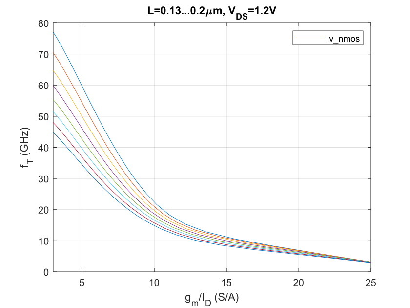
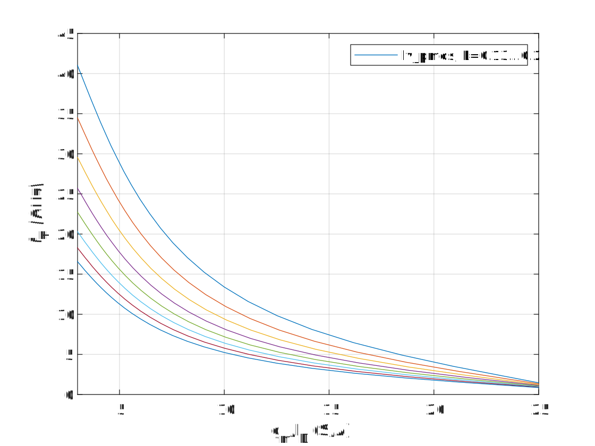
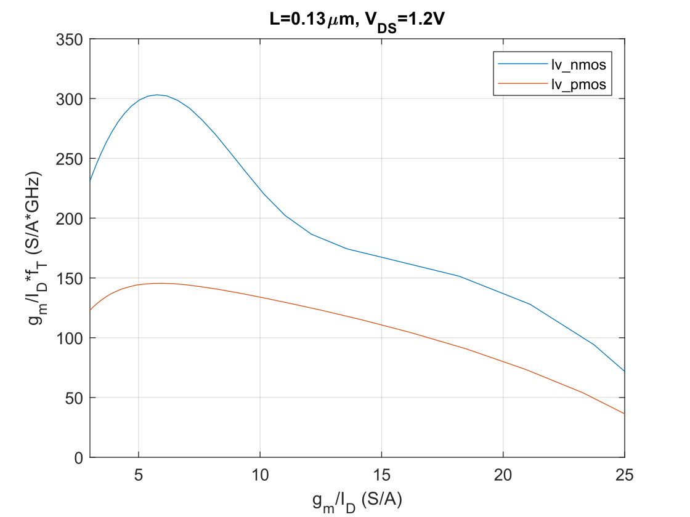

   

   

The plot below shows the product $g_m/I_D \cdot f_T$. The peak is often viewed as a biasing sweet spot. The unusual "hump" in the NMOS product hints at modeling issues in moderate inversion ($g_m/I_D>10 S/A$). These curves usually look like like upside down parabolas without drastic slope changes.

   

