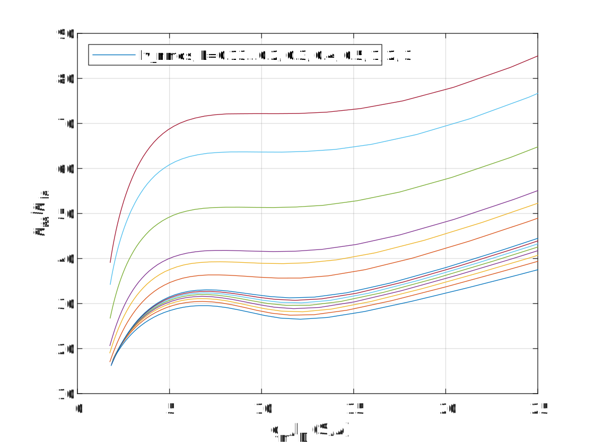
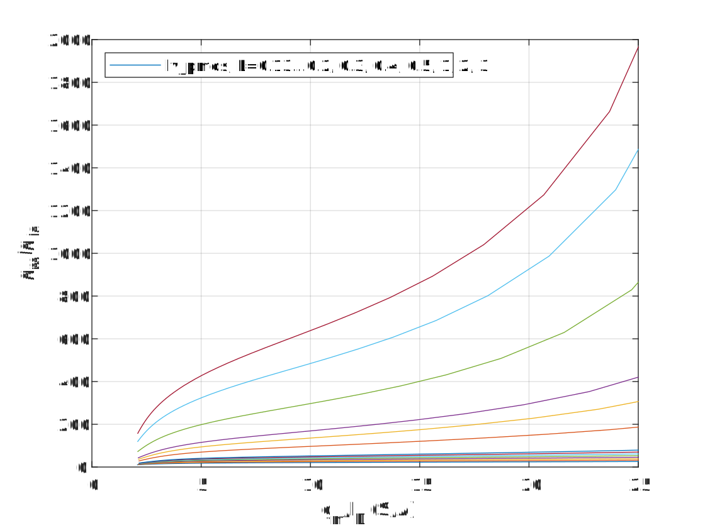
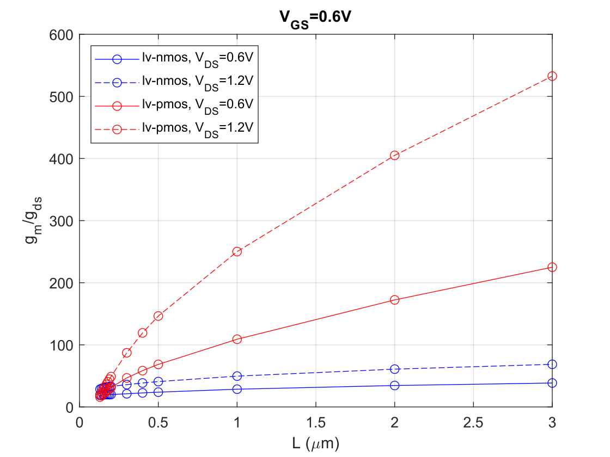

   

The above NMOS plot has an odd-looking curvature at the transition between strong to moderate inversion (for short channels).

   

The above PMOS plot likely shows unrealistically large values for long channels. Below is another comparison with fixed $V_{GS}$. Is CLM properly modeled? Perhaps mainly DIBL was considered, which does not matter for long L.

   

