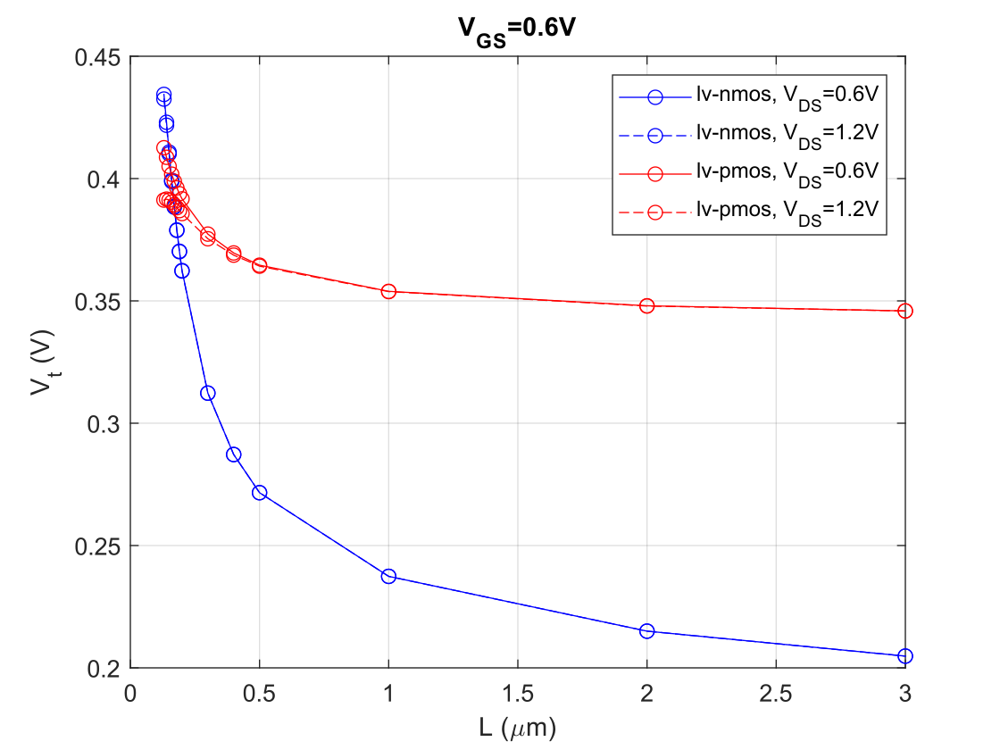

   

The NMOS $V_t$ shows almost no DIBL ($V_{DS}$ dependence). The PMOS shows DIBL at short channel lengths (makes sense).

The reverse short channel effect (RSCE) is very strong for the NMOS. This is also seen in the measurement data provided by IHP.

