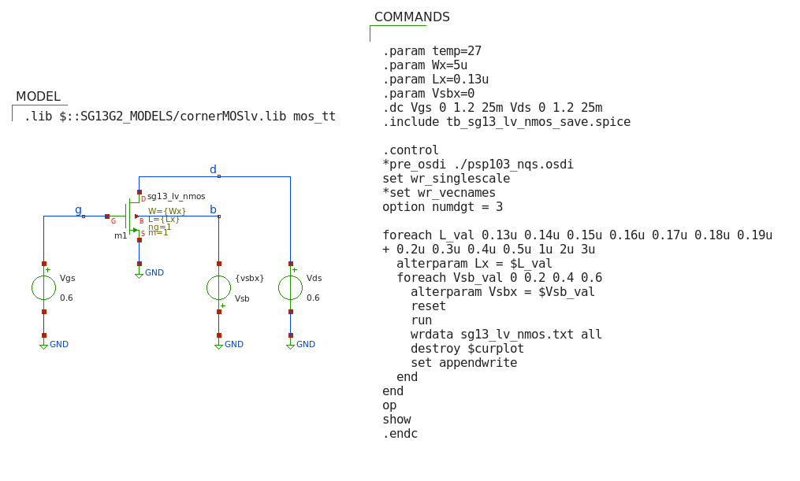
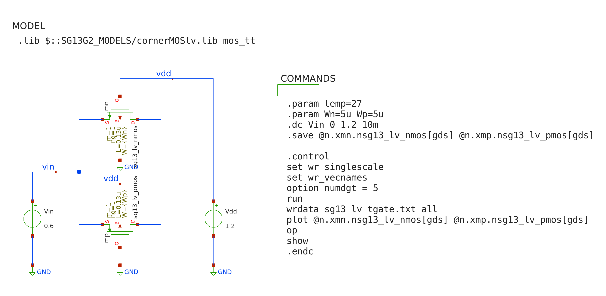

EE 628 uses the [IHP 130nm BiCMOS Open Source PDK](https://github.com/IHP-GmbH/IHP-Open-PDK). Note that this kit is still in the "preview" phase. The preliminary PDK version examined here is the one contained in the 2023.12 release of the [IIC-OSIC-TOOLS](https://github.com/iic-jku/IIC-OSIC-TOOLS) container. 

This directory contains basic LV MOSFET characterization data that is useful for analog/mixed-signal design. The subdirectories contain the following plots:  
* $g_m/I_D$ and $f_T$ versus gate bias and for minimum channel length. This is useful as an overview and for NMOS vs. PMOS comparison.
* $f_T$ vs. $g_m/I_D$ tradeoff plot for various channel lengths, as well as a plot of the product $g_m/I_D \cdot f_T$.  
* $C_{dd}/W$ (total drain capacitance per width) vs. $V_{DS}$.  
* $g_m/g_{ds}$ (intrinsic gain) vs. $g_m/I_D$ for various channel lengths.
* $I_D/W$ (current density) vs. $g_m/I_D$ for various channel lengths. This plot is useful for device sizing.
* $V_t$ vs. $L$. This is useful for looking at the reverse short chanel effect (RSCE).
* On-resistance of a transmission gate vs. input voltage. This is useful for switch sizing in switched-capacitor circuits.  

The figures below show the testbench setup in Xschem. For the $g_m/I_D$-related plots the output data were processed as follows (see files in the src directory):
* Read the Ngspice raw output data (txt) into Matlab
* Combine some of the data into the desired parameters (e.g., $CGG = cgg+cgsol  +cgdol$)
* Save each parameter set (NMOS, PMOS) in mat file format as used in the [Book-on-gm-ID-design](https://github.com/bmurmann/Book-on-gm-ID-design)
* Use the look_up function to read the mat file data and generate the example plots
* The mat files can of course be used for other purposes, such as circuit sizing scripts

The transmission gate simulation data is directly read into Matlab for plotting.

   

   

